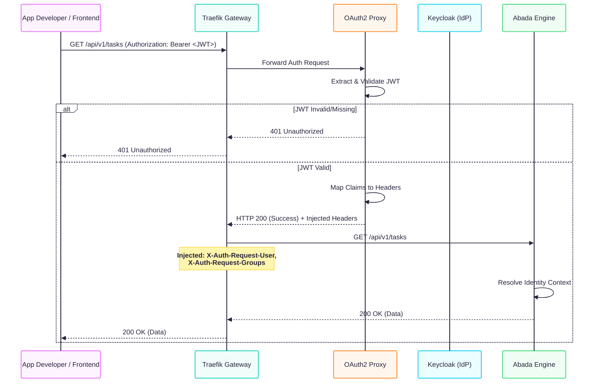
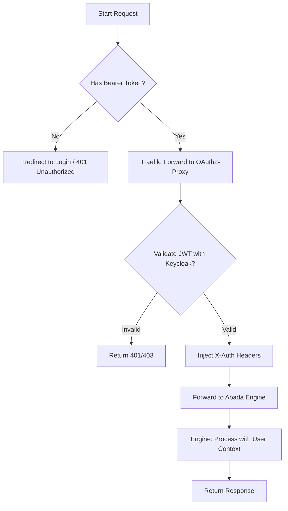

# Abada Engine Authentication Guide

This guide explains how the Abada Engine authentication system works, how to interact with it, and the architecture behind it.

## 🏗️ Architecture Overview

The Abada Engine uses a **Gateway-based Authentication** pattern. Instead of the engine itself handling login logic, it delegates this to **Traefik** and **Keycloak**.

### Components
- **Traefik**: The entry point (API Gateway). It routes requests and enforces authentication.
- **Keycloak**: The Identity Provider (IdP). It manages users, groups, and issues JWT tokens.
- **OAuth2-Proxy**: A middleware that validates JWT tokens against Keycloak and injects identity headers into the request before it reaches the Engine.
- **Abada Engine**: The core service. it receives pre-validated identity information via HTTP headers.

---

## 📊 Interaction Diagrams

### 1. Request Flow (Sequence Diagram)

This diagram shows what happens when an application developer (or a frontend) makes a request to the Abada Engine.



### 2. Logical Flow (Activity Diagram)



---

## 🔗 Important URLs (Development)

In the default development environment, use the following URLs:

| Service | URL | Description |
|---------|-----|-------------|
| **Abada Engine API** | `https://localhost/api` | Base URL for all Engine API calls. |
| **Keycloak Console** | `https://keycloak.localhost` | Identity management (Users/Groups). |
| **Keycloak Token URL**| `https://keycloak.localhost/realms/abada-dev/protocol/openid-connect/token` | Use this to exchange credentials for a JWT. |
| **Traefik Dashboard** | `http://localhost:8081` | Monitor routing and middleware status. |

> **Note**: For `keycloak.localhost` to work on your local machine, you may need to add `127.0.0.1 keycloak.localhost` to your `/etc/hosts` file. Since we use self-signed certificates in development, you must use the `--bootstrap` or `--insecure` flag with `curl`.

---

## 🛠️ How to Authenticate as a Developer

To interact with the Engine API, you must first obtain a JWT token from Keycloak.

### 1. Request a Token
You can use `curl` or tools like Postman to get a token using the **Resource Owner Password Credentials** flow (common for dev/testing):

```bash
TOKEN=$(curl -s -X POST https://keycloak.localhost/realms/abada-dev/protocol/openid-connect/token \
  -d "client_id=abada-frontend" \
  -d "username=alice" \
  -d "password=alice" \
  -d "grant_type=password" \
  --insecure | jq -r .access_token)

echo "Bearer $TOKEN"
```

### 2. Call the Engine API
Once you have the token, include it in the `Authorization` header. Note the usage of `--insecure` to skip certificate validation in dev:

```bash
curl --insecure -H "Authorization: Bearer $TOKEN" \
     https://localhost/api/v1/info
```

---

## 🆔 Identity Context (Headers)

The Abada Engine automatically parses headers injected by the gateway. If you are developing extensions or debugging, these are the headers you should look for:

- `X-Auth-Request-User`: The username of the authenticated user (e.g., `alice`).
- `X-Auth-Request-Groups`: Comma-separated list of groups the user belongs to (e.g., `managers,users`).
- `X-Auth-Request-Email`: The email address of the user.

Within the engine code, this information is available via the `IdentityContext`.

---

## 🛑 Common Errors

- **401 Unauthorized**: Missing or expired token. Obtain a new token from Keycloak.
- **403 Forbidden**: Token is valid, but the user does not have required permissions/groups for the specific action.
- **Connection Refused**: Ensure the docker stack is running and you are calling port `80` (Traefik), not the internal engine port.
