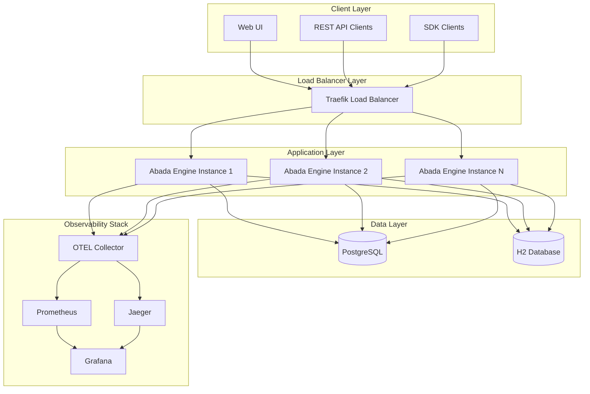
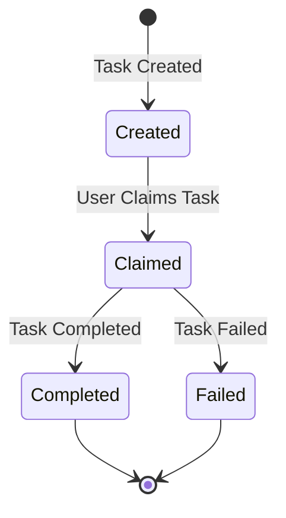
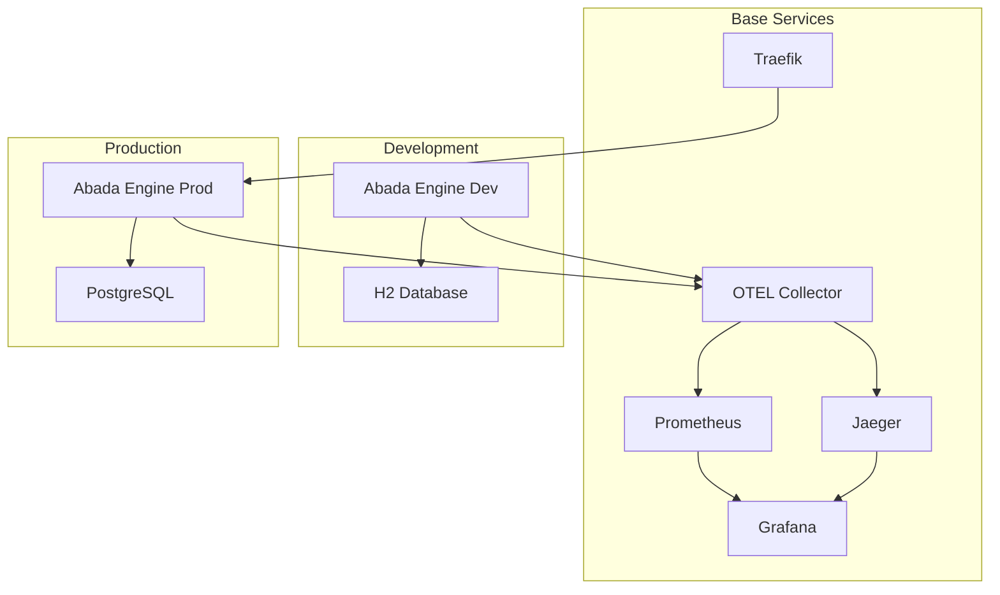
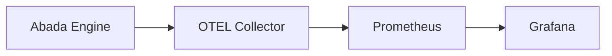
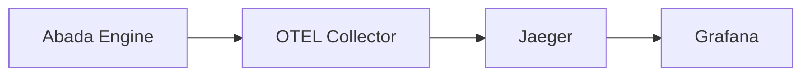

# Abada Engine: Architecture and Deployment Guide

## Table of Contents

1. [Overview](#overview)
2. [System Architecture](#system-architecture)
3. [Component Details](#component-details)
4. [Deployment Architecture](#deployment-architecture)
5. [Environment Configurations](#environment-configurations)
6. [Observability Stack](#observability-stack)
7. [Database Architecture](#database-architecture)
8. [Load Balancing Strategy](#load-balancing-strategy)
9. [Security Considerations](#security-considerations)
10. [Scaling Strategies](#scaling-strategies)
11. [Monitoring and Alerting](#monitoring-and-alerting)
12. [Troubleshooting Guide](#troubleshooting-guide)
13. [Development Workflow](#development-workflow)
14. [Production Deployment](#production-deployment)

## Overview

The Abada Engine is a BPMN 2.0 compliant process engine built with Spring Boot 3, featuring comprehensive observability through OpenTelemetry, and designed for cloud-native deployment with Docker and Kubernetes.

### Key Features

- **BPMN 2.0 Compliance**: Full support for process definitions, tasks, gateways, and events
- **Stateless Design**: Horizontally scalable with shared database state
- **Comprehensive Observability**: Metrics, traces, and logs via OpenTelemetry
- **Multi-Environment Support**: Development, test, and production configurations
- **Load Balancing**: Traefik-based load balancing for high availability
- **Database Flexibility**: H2 for development, PostgreSQL for production

## System Architecture

### High-Level Architecture



### Core Components

#### 1. Abada Engine Core

**Technology Stack:**
- Spring Boot 3.2+
- Java 21
- Hibernate/JPA
- Micrometer (Metrics)
- OpenTelemetry (Tracing)

**Key Modules:**
```
com.abada.engine/
├── api/                 # REST API controllers
├── core/                # Core BPMN engine logic
│   ├── AbadaEngine.java # Main engine class
│   ├── TaskManager.java # Task lifecycle management
│   ├── EventManager.java # Event processing
│   └── JobScheduler.java # Timer and async tasks
├── persistence/         # Data access layer
├── observability/      # Metrics and tracing
├── parser/             # BPMN parsing
└── security/           # Authentication/authorization
```

#### 2. Process Execution Engine

**Process Lifecycle:**
1. **Deployment**: BPMN process definitions are parsed and validated
2. **Instantiation**: Process instances are created from definitions
3. **Execution**: Tokens flow through the process according to BPMN rules
4. **Task Management**: User tasks are created, claimed, and completed
5. **Event Processing**: Messages, signals, and timers are handled
6. **Completion**: Process instances complete or terminate

**State Management:**
- Process instances are persisted to database
- Each engine instance maintains its own connection pool
- Shared state through database transactions
- Stateless design enables horizontal scaling

#### 3. Task Management System

**Task Lifecycle:**


**Task Types:**
- **User Tasks**: Human-interactive tasks
- **Service Tasks**: Automated service calls
- **Script Tasks**: JavaScript/Java script execution
- **External Tasks**: External system integration

## Component Details

### Abada Engine Core Classes

#### AbadaEngine.java
```java
@Component
public class AbadaEngine {
    // Process definition management
    private final Map<String, ParsedProcessDefinition> processDefinitions;
    
    // Process instance management
    private final Map<String, ProcessInstance> instances;
    
    // Core operations
    public ProcessInstance startProcess(String processDefinitionId);
    public void completeTask(String taskId);
    public void correlateMessage(String messageName, String correlationKey, Map<String, Object> variables);
    public void broadcastSignal(String signalName, Map<String, Object> variables);
}
```

#### TaskManager.java
```java
@Component
public class TaskManager {
    // Task lifecycle management
    public void createTask(String taskDefinitionKey, String name, String processInstanceId, ...);
    public void claimTask(String taskId, String user, List<String> userGroups);
    public void completeTask(String taskId);
    public void failTask(String taskId, String reason);
}
```

#### EventManager.java
```java
@Component
public class EventManager {
    // Event subscription management
    public void registerWaitStates(ProcessInstance instance);
    
    // Event publishing
    public void publishMessage(String messageName, String correlationKey, Map<String, Object> variables);
    public void publishSignal(String signalName, Map<String, Object> variables);
    
    // Event correlation
    public void correlateMessage(String messageName, String correlationKey, Map<String, Object> variables);
    public void broadcastSignal(String signalName, Map<String, Object> variables);
}
```

### REST API Endpoints

#### Process Management
```
POST   /abada/api/processes/{id}/start
GET    /abada/api/processes/{id}/instances
GET    /abada/api/processes/{id}/instances/{instanceId}
DELETE /abada/api/processes/{id}/instances/{instanceId}
```

#### Task Management
```
GET    /abada/api/tasks
POST   /abada/api/tasks/{id}/claim
POST   /abada/api/tasks/{id}/complete
POST   /abada/api/tasks/{id}/fail
```

#### Event Management
```
POST   /abada/api/events/messages
POST   /abada/api/events/signals
```

## Deployment Architecture

### Docker Compose Structure

```
abada-engine/
├── docker-compose.yml          # Base services (OTEL, Jaeger, Prometheus, Grafana, Traefik)
├── docker-compose.dev.yml      # Development overrides
├── docker-compose.test.yml     # Test overrides
├── docker-compose.prod.yml     # Production overrides
├── docker/
│   ├── otel-collector-config.yaml
│   ├── prometheus.yml
│   ├── grafana/
│   │   ├── dashboards/
│   │   └── provisioning/
│   └── traefik/
│       └── traefik.yml
└── env.example
```

### Service Dependencies



## Environment Configurations

### Development Environment

**Purpose**: Local development with full observability and debug capabilities

**Configuration:**
```yaml
# docker-compose.dev.yml
services:
  abada-engine:
    environment:
      - SPRING_PROFILES_ACTIVE=dev
      - MANAGEMENT_TRACING_SAMPLING_PROBABILITY=1.0  # 100% sampling
    ports:
      - "5601:5601"  # Direct access
    volumes:
      - ./data:/app/data  # H2 persistence
```

**Features:**
- H2 embedded database with console access
- 100% trace sampling for debugging
- Verbose logging (DEBUG level)
- Direct port exposure (no load balancer)
- Hot reloading support

**Access URLs:**
- Engine: http://localhost:5601/abada/api
- H2 Console: http://localhost:5601/abada/api/h2-console
- Grafana: http://localhost:3000
- Jaeger: http://localhost:16686

### Test Environment

**Purpose**: Automated testing with reduced resource usage

**Configuration:**
```yaml
# docker-compose.test.yml
services:
  abada-engine:
    environment:
      - SPRING_PROFILES_ACTIVE=test
      - MANAGEMENT_TRACING_SAMPLING_PROBABILITY=0.5  # 50% sampling
    restart: "no"  # No restart for tests
```

**Features:**
- H2 in-memory database (no persistence)
- 50% trace sampling
- Minimal logging
- No restart policies
- Fast startup/shutdown

### Production Environment

**Purpose**: High-availability production deployment

**Configuration:**
```yaml
# docker-compose.prod.yml
services:
  postgres:
    image: postgres:15-alpine
    environment:
      - POSTGRES_DB=abada_engine
      - POSTGRES_USER=abada
      - POSTGRES_PASSWORD=${POSTGRES_PASSWORD}
    volumes:
      - postgres_data:/var/lib/postgresql/data
  
  abada-engine:
    deploy:
      replicas: 3
      resources:
        limits:
          cpus: '1.0'
          memory: 1G
    environment:
      - SPRING_PROFILES_ACTIVE=prod
      - MANAGEMENT_TRACING_SAMPLING_PROBABILITY=0.1  # 10% sampling
    labels:
      - "traefik.enable=true"
      - "traefik.http.routers.abada.rule=PathPrefix(`/abada`)"
```

**Features:**
- PostgreSQL database with connection pooling
- Multiple engine instances (3+ replicas)
- Traefik load balancing
- 10% trace sampling (configurable)
- Resource limits and health checks
- Persistent data volumes

## Observability Stack

### OpenTelemetry Integration

#### Metrics Flow


**Key Metrics:**
- `abada_process_instances_started` - Process creation rate
- `abada_process_instances_completed` - Process completion rate
- `abada_tasks_created` - Task creation rate
- `abada_tasks_completed` - Task completion rate
- `abada_events_published` - Event publication rate
- `abada_events_correlated` - Event correlation success rate

#### Traces Flow


**Trace Spans:**
- `abada.process.start` - Process instance creation
- `abada.task.create` - Task creation
- `abada.task.complete` - Task completion
- `abada.event.correlate.message` - Message correlation
- `abada.event.broadcast.signal` - Signal broadcasting

### OTEL Collector Configuration

```yaml
# docker/otel-collector-config.yaml
receivers:
  otlp:
    protocols:
      grpc:
        endpoint: 0.0.0.0:4317
      http:
        endpoint: 0.0.0.0:4318

processors:
  batch:
    timeout: 1s
    send_batch_size: 1024
  memory_limiter:
    limit_mib: 512

exporters:
  jaeger:
    endpoint: jaeger:14250
  prometheus:
    endpoint: "0.0.0.0:8889"
    namespace: abada
```

### Prometheus Configuration

```yaml
# docker/prometheus.yml
scrape_configs:
  - job_name: 'abada-engine'
    static_configs:
      - targets: ['abada-engine:5601']
    metrics_path: /abada/api/actuator/prometheus
    scrape_interval: 15s
```

### Grafana Dashboards

#### Abada Engine Overview Dashboard
- Process instance metrics (started, completed, failed)
- Task metrics (created, completed, failed)
- Event metrics (published, consumed, correlated)
- System health indicators

#### Task Details Dashboard
- Task waiting time distributions (p50, p95, p99)
- Task processing time distributions
- Task completion rates by type
- Success/failure ratios

## Database Architecture

### Development Database (H2)

**Configuration:**
```yaml
spring:
  datasource:
    url: jdbc:h2:file:./data/abada-dev-db
    driver-class-name: org.h2.Driver
    username: sa
    password: abada123
  jpa:
    database-platform: org.hibernate.dialect.H2Dialect
```

**Features:**
- File-based persistence
- H2 console access
- Automatic schema creation
- Debug SQL logging

### Production Database (PostgreSQL)

**Configuration:**
```yaml
spring:
  datasource:
    url: jdbc:postgresql://postgres:5432/abada_engine
    driver-class-name: org.postgresql.Driver
    username: abada
    password: ${POSTGRES_PASSWORD}
    hikari:
      maximum-pool-size: 10
      minimum-idle: 5
      connection-timeout: 30000
  jpa:
    database-platform: org.hibernate.dialect.PostgreSQLDialect
```

**Connection Pooling:**
- Each engine instance maintains its own HikariCP pool
- 10 connections per instance (configurable)
- Connection timeout: 30 seconds
- Idle timeout: 10 minutes
- Max lifetime: 30 minutes

### Database Schema

**Core Tables:**
```sql
-- Process definitions
CREATE TABLE process_definition (
    id VARCHAR(255) PRIMARY KEY,
    name VARCHAR(255) NOT NULL,
    version INTEGER NOT NULL,
    definition_xml TEXT NOT NULL,
    created_at TIMESTAMP DEFAULT CURRENT_TIMESTAMP
);

-- Process instances
CREATE TABLE process_instance (
    id VARCHAR(255) PRIMARY KEY,
    process_definition_id VARCHAR(255) NOT NULL,
    status VARCHAR(50) NOT NULL,
    variables JSONB,
    started_at TIMESTAMP DEFAULT CURRENT_TIMESTAMP,
    ended_at TIMESTAMP,
    FOREIGN KEY (process_definition_id) REFERENCES process_definition(id)
);

-- Tasks
CREATE TABLE task_instance (
    id VARCHAR(255) PRIMARY KEY,
    process_instance_id VARCHAR(255) NOT NULL,
    task_definition_key VARCHAR(255) NOT NULL,
    name VARCHAR(255) NOT NULL,
    assignee VARCHAR(255),
    status VARCHAR(50) NOT NULL,
    created_at TIMESTAMP DEFAULT CURRENT_TIMESTAMP,
    claimed_at TIMESTAMP,
    completed_at TIMESTAMP,
    FOREIGN KEY (process_instance_id) REFERENCES process_instance(id)
);
```

## Load Balancing Strategy

### Traefik Configuration

**Load Balancing Algorithm:** Round-robin

**Health Checks:**
```yaml
labels:
  - "traefik.http.services.abada.loadbalancer.healthcheck.path=/abada/api/actuator/health"
  - "traefik.http.services.abada.loadbalancer.healthcheck.interval=30s"
```

**Routing Rules:**
```yaml
labels:
  - "traefik.enable=true"
  - "traefik.http.routers.abada.rule=PathPrefix(`/abada`)"
  - "traefik.http.services.abada.loadbalancer.server.port=5601"
```

### Scaling Strategy

**Horizontal Scaling:**
```bash
# Scale to 5 instances
docker compose -f docker-compose.yml -f docker-compose.prod.yml up -d --scale abada-engine=5

# Scale down to 2 instances
docker compose -f docker-compose.yml -f docker-compose.prod.yml up -d --scale abada-engine=2
```

**Stateless Design:**
- No session affinity required
- Shared database state
- Any instance can handle any request
- Automatic failover

## Security Considerations

### Network Security

**Docker Networks:**
```yaml
networks:
  abada-network:
    driver: bridge
    internal: false  # Allow external access
```

**Port Exposure:**
- **Development**: Direct port exposure for debugging
- **Production**: Only Traefik exposed, internal service communication

### Authentication & Authorization

**Current Implementation:**
- Basic authentication for REST API
- User context for task assignment
- Role-based access control (planned)

**Security Headers:**
```yaml
# Traefik security headers
labels:
  - "traefik.http.middlewares.security-headers.headers.customRequestHeaders.X-Forwarded-Proto=https"
  - "traefik.http.middlewares.security-headers.headers.customRequestHeaders.X-Forwarded-For="
```

### Data Security

**Database Security:**
- Encrypted connections (TLS)
- Strong passwords via environment variables
- Connection pooling limits
- Query parameterization

**Secrets Management:**
```bash
# Use Docker secrets in production
echo "your_secure_password" | docker secret create postgres_password -
```

## Scaling Strategies

### Vertical Scaling

**Resource Limits:**
```yaml
deploy:
  resources:
    limits:
      cpus: '1.0'
      memory: 1G
    reservations:
      cpus: '0.5'
      memory: 512M
```

**JVM Tuning:**
```bash
# Add to docker-compose environment
JAVA_OPTS=-Xms512m -Xmx1g -XX:+UseG1GC -XX:+UseStringDeduplication
```

### Horizontal Scaling

**Database Scaling:**
- Read replicas for query distribution
- Connection pooling per instance
- Database connection limits

**Application Scaling:**
- Stateless design enables unlimited scaling
- Load balancer distributes requests
- Health checks ensure availability

### Auto-Scaling (Kubernetes)

**HPA Configuration:**
```yaml
apiVersion: autoscaling/v2
kind: HorizontalPodAutoscaler
metadata:
  name: abada-engine-hpa
spec:
  scaleTargetRef:
    apiVersion: apps/v1
    kind: Deployment
    name: abada-engine
  minReplicas: 3
  maxReplicas: 10
  metrics:
  - type: Resource
    resource:
      name: cpu
      target:
        type: Utilization
        averageUtilization: 70
```

## Monitoring and Alerting

### Key Metrics to Monitor

**Process Metrics:**
- Process instance creation rate
- Process completion rate
- Process failure rate
- Average process duration

**Task Metrics:**
- Task creation rate
- Task completion rate
- Task waiting time (p95, p99)
- Task processing time (p95, p99)

**System Metrics:**
- CPU utilization
- Memory usage
- Database connection pool usage
- JVM heap usage

### Alert Rules

**Prometheus Alert Rules:**
```yaml
groups:
- name: abada-engine
  rules:
  - alert: HighProcessFailureRate
    expr: rate(abada_process_instances_failed_total[5m]) > 0.1
    for: 2m
    labels:
      severity: warning
    annotations:
      summary: "High process failure rate detected"
  
  - alert: HighTaskWaitingTime
    expr: histogram_quantile(0.95, abada_task_waiting_time_seconds) > 300
    for: 5m
    labels:
      severity: critical
    annotations:
      summary: "Task waiting time is too high"
```

### Grafana Dashboards

**Pre-configured Dashboards:**
1. **Abada Engine Overview**
   - Process metrics overview
   - Task metrics overview
   - System health status

2. **Task Details**
   - Task performance metrics
   - Waiting time distributions
   - Completion rates

3. **Infrastructure**
   - Container metrics
   - Database metrics
   - Load balancer metrics

## Troubleshooting Guide

### Common Issues

#### 1. High Memory Usage

**Symptoms:**
- Container memory limit exceeded
- OutOfMemoryError in logs
- Slow response times

**Diagnosis:**
```bash
# Check container memory usage
docker stats abada-engine

# Check JVM heap usage
curl http://localhost:5601/abada/api/actuator/metrics/jvm.memory.used
```

**Solutions:**
- Increase memory limits in docker-compose
- Tune JVM heap settings
- Check for memory leaks in application

#### 2. Database Connection Issues

**Symptoms:**
- Connection timeout errors
- Database unavailable errors
- Slow database queries

**Diagnosis:**
```bash
# Check database connectivity
docker compose exec postgres pg_isready -U abada

# Check connection pool metrics
curl http://localhost:5601/abada/api/actuator/metrics/hikaricp.connections.active
```

**Solutions:**
- Increase connection pool size
- Check database resource limits
- Optimize database queries

#### 3. Load Balancer Issues

**Symptoms:**
- 502 Bad Gateway errors
- Uneven load distribution
- Health check failures

**Diagnosis:**
```bash
# Check Traefik logs
docker compose logs traefik

# Check service health
curl http://localhost:8080/api/http/services
```

**Solutions:**
- Verify health check endpoints
- Check service labels
- Restart unhealthy services

### Debug Commands

**Container Management:**
```bash
# View all containers
docker compose ps

# View logs
docker compose logs abada-engine
docker compose logs -f abada-engine  # Follow logs

# Execute commands in container
docker compose exec abada-engine bash
docker compose exec postgres psql -U abada -d abada_engine
```

**Health Checks:**
```bash
# Check service health
curl http://localhost:5601/abada/api/actuator/health

# Check metrics
curl http://localhost:5601/abada/api/actuator/prometheus

# Check traces
curl http://localhost:16686/api/services
```

**Database Operations:**
```bash
# Backup database
docker compose exec postgres pg_dump -U abada abada_engine > backup.sql

# Restore database
docker compose exec -T postgres psql -U abada abada_engine < backup.sql

# Check database size
docker compose exec postgres psql -U abada -d abada_engine -c "SELECT pg_size_pretty(pg_database_size('abada_engine'));"
```

## Development Workflow

### Local Development Setup

1. **Clone Repository:**
```bash
git clone <repository-url>
cd abada-engine
```

2. **Environment Setup:**
```bash
cp env.example .env
# Edit .env with your preferences
```

3. **Start Development Environment:**
```bash
docker compose -f docker-compose.yml -f docker-compose.dev.yml up -d
```

4. **Access Services:**
- Engine: http://localhost:5601/abada/api
- Grafana: http://localhost:3000
- Jaeger: http://localhost:16686

### Code Development

**Project Structure:**
```
src/main/java/com/abada/engine/
├── api/                 # REST controllers
├── core/                # Core engine logic
├── persistence/         # Data access
├── observability/      # Metrics and tracing
└── parser/             # BPMN parsing
```

**Key Development Commands:**
```bash
# Run tests
mvn test

# Run specific test
mvn test -Dtest=EventMetricsIntegrationTest

# Build application
mvn clean package

# Run application locally
mvn spring-boot:run
```

### Testing Strategy

**Unit Tests:**
- Test individual components in isolation
- Mock external dependencies
- Use `@Profile("test")` for test-specific configurations

**Integration Tests:**
- Test component interactions
- Use test containers for database testing
- Verify observability metrics

**End-to-End Tests:**
- Test complete process flows
- Use Docker Compose test environment
- Verify load balancing behavior

### Code Quality

**Linting:**
```bash
# Check code style
mvn checkstyle:check

# Fix code style issues
mvn checkstyle:checkstyle
```

**Security Scanning:**
```bash
# Dependency vulnerability scan
mvn org.owasp:dependency-check-maven:check
```

## Production Deployment

### Pre-Deployment Checklist

- [ ] Environment variables configured
- [ ] Database credentials secured
- [ ] Resource limits set appropriately
- [ ] Health checks configured
- [ ] Monitoring dashboards configured
- [ ] Backup strategy implemented
- [ ] SSL certificates configured (if needed)

### Deployment Steps

1. **Prepare Environment:**
```bash
# Copy environment template
cp env.example .env

# Configure production settings
export POSTGRES_PASSWORD=your_secure_password
export GRAFANA_ADMIN_PASSWORD=your_secure_password
```

2. **Deploy Services:**
```bash
# Deploy production stack
docker compose -f docker-compose.yml -f docker-compose.prod.yml up -d

# Verify deployment
docker compose -f docker-compose.yml -f docker-compose.prod.yml ps
```

3. **Verify Health:**
```bash
# Check all services are healthy
curl http://localhost/abada/api/actuator/health
curl http://localhost:3000/api/health
curl http://localhost:16686/api/services
```

4. **Monitor Deployment:**
- Check Grafana dashboards
- Verify metrics collection
- Test load balancing
- Monitor resource usage

### Scaling in Production

**Manual Scaling:**
```bash
# Scale to 5 instances
docker compose -f docker-compose.yml -f docker-compose.prod.yml up -d --scale abada-engine=5

# Verify scaling
docker compose -f docker-compose.yml -f docker-compose.prod.yml ps
```

**Auto-Scaling (Kubernetes):**
```yaml
# Deploy with HPA
kubectl apply -f k8s/hpa.yaml

# Monitor scaling
kubectl get hpa abada-engine-hpa
```

### Backup and Recovery

**Database Backup:**
```bash
# Create backup
docker compose exec postgres pg_dump -U abada abada_engine > backup-$(date +%Y%m%d-%H%M%S).sql

# Restore from backup
docker compose exec -T postgres psql -U abada abada_engine < backup-20240101-120000.sql
```

**Configuration Backup:**
```bash
# Backup all configurations
tar -czf abada-config-backup-$(date +%Y%m%d).tar.gz docker/ *.yml .env
```

### Maintenance

**Regular Maintenance Tasks:**
- Monitor resource usage
- Review and rotate logs
- Update dependencies
- Backup database
- Review security patches

**Update Deployment:**
```bash
# Pull latest images
docker compose -f docker-compose.yml -f docker-compose.prod.yml pull

# Restart services
docker compose -f docker-compose.yml -f docker-compose.prod.yml up -d
```

---

## Conclusion

This architecture and deployment guide provides comprehensive information for developers working with the Abada Engine. The system is designed for scalability, observability, and maintainability, with clear separation between development, test, and production environments.

For additional support or questions, refer to:
- Project documentation in `/docs`
- API documentation at `/abada/api/docs`
- Monitoring dashboards in Grafana
- Issue tracking in the project repository
