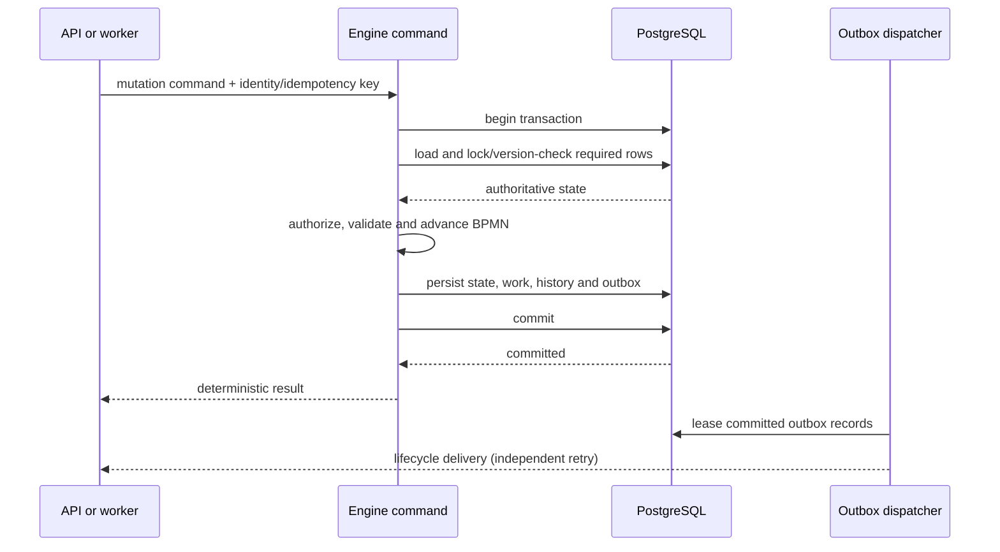

# Runtime State Architecture

This document defines the target runtime architecture for Abada 1.0 and tracks
the transition from the original in-memory engine. It is the authoritative
architecture document for mutable workflow state. The Flyway migrations are
the authority for physical table and column names.

## Target invariants

Abada 1.0 must satisfy all of these invariants:

1. **PostgreSQL is authoritative.** A command reconstructs mutable workflow
   state from committed database rows. It does not use a process-instance or
   task object left in a replica's memory as its input.
2. **Mutable state is command-local.** Tokens, joins, variables, task state,
   subscriptions and jobs are mutable only inside the command handling them.
3. **One command, one transaction.** Loading, authorization and state
   validation, BPMN advancement, persistence of resulting work and history,
   and commit form one database transaction.
4. **Conflicts are explicit.** Row locks serialize operations that must have a
   single winner; optimistic versions detect stale writes elsewhere. A retry or
   deterministic conflict response must never silently lose progress.
5. **Work is durable.** Timers, continuations and external work are database
   jobs with status, due time, lease owner, lease expiry, attempt count and
   retry data. Expired leases can be recovered by another replica.
6. **External publication follows commit.** Lifecycle events and webhooks are
   written to a transactional outbox. No external observer is told about state
   that later rolls back.
7. **Only immutable definitions may be cached.** Parsed BPMN definitions are
   cached by immutable deployment/version identifier. Cache loss changes
   performance, not behavior.

These invariants allow any request or acquired job to run on any engine
replica. Restarting or terminating a replica discards no authoritative
workflow state.

## Command lifecycle

The target command path is:

If the engine fails before commit, PostgreSQL rolls the command back and
another request or worker can retry it. If it fails after commit, the state is
already durable; an idempotency record makes a duplicate request return the
same logical result. External side effects remain at-least-once unless the
external system participates through an idempotent protocol.

## Implemented slice: user-task completion

User-task completion is the first command migrated to this model:

1. `completeTask` obtains a PostgreSQL write lock on the task row.
2. It materializes a command-local task and process instance from database
   entities and the immutable definition version.
3. It validates task ownership/status and process suspension, applies
   variables, advances tokens, and creates command-local successor tasks.
4. It persists task state, process state, successor tasks, subscriptions,
   timers, external work and activity history in the same Spring transaction.
5. It publishes the result to legacy compatibility maps only after commit.

A concurrent completion on another engine waits for the task lock, then reads
the committed `COMPLETED` status and is rejected. The PostgreSQL integration
test verifies that two engine application contexts produce one successful
completion and one `TASK_COMPLETED` history record.

The compatibility-map publication is temporary. It keeps existing read paths
working while commands are migrated, but it is not a cross-replica cache
coherence mechanism.

## Current migration status

| Area | Current behavior | 1.0 target |
|---|---|---|
| Parsed process definitions | Immutable versions are persisted and parsed definitions are cached in each replica | Keep immutable cache keyed only by definition version/deployment ID |
| User-task completion | Loads and locks task plus process state from PostgreSQL; mutates command-local objects; publishes legacy cache after commit | Retain this command model and add deterministic idempotent responses |
| Startup | Rehydrates process-instance and task maps from PostgreSQL | Load definitions only; do not rehydrate mutable runtime maps |
| Task claim/failure and process control | Several paths still read and mutate replica-local maps before persisting | Convert each command to authoritative database load and transactional mutation |
| Instance/task query APIs | Several reads are served by replica-local maps and can be stale across replicas | Query PostgreSQL-backed projections with pagination and filtering |
| Message/signal correlation | Subscriptions are durable, but all correlation paths are not yet proven command-local and concurrent-safe | Lock/consume subscriptions and advance the instance transactionally |
| Timers/external work | Durable job and lease fields exist | Prove atomic multi-replica acquisition, expiry recovery and idempotent completion |
| Metrics | Some counters are changed before transaction outcome is known | Derive durable facts or update transaction-aware metrics after commit |
| Lifecycle delivery | Activity history is durable; transactional outbox is not implemented | Persist outbox records in the command transaction and deliver with leases |

Consequently, PostgreSQL is the intended production authority, but the whole
runtime does **not yet** satisfy the target invariants. Multi-replica operation
remains experimental until the 0.10 acceptance gate passes.

## Concurrency policy

- Use pessimistic row locking for a singular transition with a natural owner,
  such as completing one user task or consuming one subscription.
- Use optimistic version columns on mutable aggregate records to detect stale
  updates and protect paths that cannot lock every row up front.
- Use atomic lease acquisition, preferably PostgreSQL `FOR UPDATE SKIP LOCKED`,
  for competing workers claiming independent jobs.
- Keep transactions short: never perform remote service calls while holding a
  workflow row lock.
- Require an idempotency key or protocol identity where a client can repeat a
  mutation after losing the response.

Exactly-once refers to committed workflow state transitions. Calls to external
systems are at-least-once unless their own idempotency contract prevents a
duplicate side effect.

## Cache policy

Allowed caches contain immutable parsed process definitions. They may be
discarded and reconstructed from a stored BPMN definition without changing
execution semantics.

Mutable process instances, tasks, subscriptions, jobs and variables must not be
runtime-wide cache entries in the final architecture. During migration, any
remaining compatibility map is non-authoritative and cannot be consulted by a
migrated mutation command. It must be updated only after transaction commit.

## Completion criteria

The migration is complete only when:

- every mutation command follows the command lifecycle above;
- query APIs read database projections rather than mutable replica maps;
- startup rehydrates only immutable definitions;
- multi-replica tests cover task commands, correlation, timers and external
  work, including replica termination around commit;
- duplicate requests return deterministic results; and
- outbox delivery, lease recovery and supported rolling upgrades pass their
  PostgreSQL acceptance suites.

Progress and test evidence are tracked in the
[Reliable OSS Core roadmap](../development/roadmap.md).
