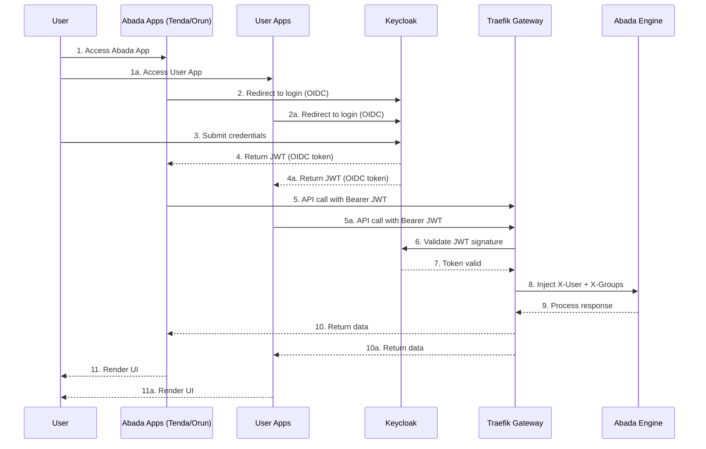

# Abada Engine Authentication & Authorization Architecture

This document explains how **authentication and authorization** are integrated into the **Abada Engine** ecosystem using **Keycloak** and **Traefik Gateway**.

---

## 🔐 Overview

The Abada Engine itself is **auth-agnostic**.
It only needs two identity facts at runtime:

* `username`
* `groups` (roles the user belongs to)

These values are used to evaluate BPMN attributes:

* `assignee="alice"`
* `candidateUsers="bob, charlie"`
* `candidateGroups="finance, hr"`

Authentication and group management are delegated to **Keycloak**, and security enforcement is handled by **Traefik Gateway**.

---

## ⚙️ Architecture

```mermaid
flowchart TB
    %% Clusters
    subgraph DBs [PostgreSQL Cluster]
        AE_DB[(Abada Engine DB)]
        KC_DB[(Keycloak DB)]
    end

    subgraph Identity
        KC[Keycloak]
    end

    subgraph Engine
        AE[Abada Engine]
    end

    subgraph Gateway
        GW[Traefik Gateway]
    end

    subgraph Apps
        AA[Abada Apps (Tenda, Orun)]
        UA[User Apps]
    end

    %% Flows
    U[User] --> AA
    U --> UA
    AA --> GW
    UA --> GW
    GW --> KC
    GW --> AE
    KC --> KC_DB
    AE --> AE_DB
    
    %% Authentication flows
    AA -.->|auth request| KC
    UA -.->|auth request| KC
```

* **Keycloak** handles login, group membership, and token issuance.
* **Traefik Gateway** validates JWT tokens and injects `username + groups`.
* **Abada Engine** consumes identity info but does not implement auth logic.
* **Postgres** provides persistence (two DBs: one for Keycloak, one for Abada).

---

## 🔄 Sequence Flow



---

## 🏗️ Components

* **Keycloak**

  * Provides login, group management, and JWT issuance.
  * Stores its state in a dedicated PostgreSQL database.

* **Traefik Gateway**

  * Validates JWTs against Keycloak.
  * Extracts claims (`sub`, `groups`) and injects them into headers.
  * Routes requests to the correct backend service.

* **Abada Engine**

  * Stateless regarding authentication.
  * Reads `X-User` and `X-Groups` headers to evaluate BPMN assignments.
  * Uses its own PostgreSQL database for process state and audit.

* **PostgreSQL Cluster**

  * `abada` database: for engine state, tasks, audit.
  * `keycloak` database: for users, groups, roles, sessions.

* **User Applications (Any App including Tenda and Orun)**

  * Frontend or backend apps that users interact with.
  * Delegate authentication to Keycloak.
  * Call Abada Engine APIs through the gateway with validated JWTs.
