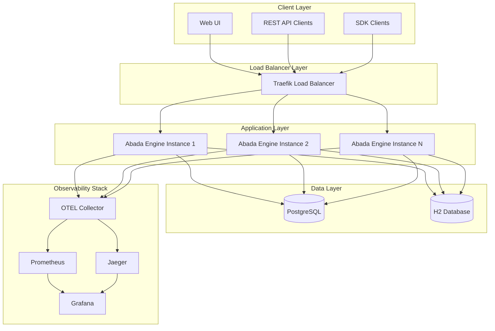

# Abada Platform Overview

## Introduction

Abada Platform is a modular, culturally-rooted BPMN 2.0 process automation platform built on Java 21 and Spring Boot 3. It provides a lightweight, embeddable workflow engine with first-class observability and production-ready Docker deployment for dev, test, and prod environments.

## Architecture

The platform follows a microservices architecture with three main components:

1. **Engine** - The core BPMN execution engine with REST API
2. **Tenda** - End-user task UI for managing workflow tasks
3. **Orun** - Monitoring and observability dashboard
4. **Admin** and **Semaflow** - External repositories for admin and NL-to-BPMN tooling

### High-Level Architecture



## Technology Stack

### Backend (Engine)
- **Java 21** with **Spring Boot 3.5.6**
- **Maven** for dependency management
- **Hibernate/JPA** for data persistence
- **PostgreSQL** (production) and **H2** (development) databases
- **Camunda BPMN Model** for BPMN 2.0 compliance
- **OpenJDK Nashorn** for JavaScript execution in script tasks

### Frontend (UI Components)
- **React 18/19** with **TypeScript**
- **Vite** as the build tool
- **Tailwind CSS** and **shadcn/ui** for styling
- **bpmn-js** for BPMN diagram rendering
- **Keycloak JS** for authentication

### Observability Stack
- **OpenTelemetry** for distributed tracing, metrics, and logs
- **Jaeger** for distributed tracing visualization
- **Prometheus** for metrics collection
- **Grafana** for metrics visualization
- **Loki** for log aggregation
- **Promtail** for log shipping

### Infrastructure
- **Docker** and **Docker Compose** for containerization
- **Traefik** as the reverse proxy/load balancer
- **Keycloak** for identity management
- **OAuth2 Proxy** for JWT validation
- **HashiCorp Consul** for service discovery

## Key Features

### BPMN 2.0 Compliance
- Full support for process definitions, tasks, gateways, and events
- Support for User/Service/Script tasks, Parallel/XOR gateways, and Message/Signal events
- Process instantiation, execution, and task management

### Observability
- Native OpenTelemetry support with automatic instrumentation
- Rich OTLP traces, metrics, and logs out of the box
- No sidecars or agents required for basic visibility
- Full-stack visibility from REST API call → BPMN Element → Database Query
- Pre-configured Grafana dashboards for process and task metrics
- Jaeger UI for distributed tracing visualization

### Security
- OIDC-compliant authentication via Keycloak
- JWT validation and role-based access control (RBAC)
- Secure communication between services
- OAuth2 Proxy for token validation

### Scalability
- Stateless engine design enabling horizontal scaling
- Shared database state for process persistence
- Traefik-based load balancing for high availability
- Connection pooling for database efficiency

## Main Services

### Core Engine (`engine/`)
- The central BPMN 2.0 process execution engine
- Written in Java 21 with Spring Boot 3
- Handles process instantiation, execution, and task management
- Provides REST API endpoints for process and task operations
- Implements BPMN 2.0 specifications

### Task Management UI (`tenda/`)
- End-user task management interface
- Built with React, TypeScript, and Tailwind CSS
- Allows users to claim, complete, and manage workflow tasks
- Integrates with Keycloak for authentication
- Runs on port 5602 by default
- Requires environment variables for API and Keycloak configuration

### Operations Cockpit (`orun/`)
- Process monitoring and observability dashboard
- Built with React and bpmn-js for process visualization
- Provides real-time insights into process execution
- Shows metrics and analytics for operational decision-making

### Identity Management
- **Keycloak**: Handles authentication and authorization
- **OAuth2 Proxy**: Validates JWT tokens and injects headers
- Provides OIDC-compliant authentication for all services

## Deployment and Development Workflow

### Development Environment
- Uses `docker-compose.dev.yml` with development overrides
- Builds from local source code using `./scripts/build-and-run-dev.sh`
- Includes H2 database for local development with console access
- Enables 100% trace sampling for debugging
- Direct port exposure for easier development
- Hot reload capabilities

### Production Environment
- Uses `docker-compose.prod.yml` with production overrides
- Employs PostgreSQL database with connection pooling
- Multiple engine instances (3+ replicas) for high availability
- Traefik load balancing for traffic distribution
- 10% trace sampling to reduce overhead
- Resource limits and health checks
- Persistent data volumes

### Quick Start Options
- Production/demo: `curl -sSL https://raw.githubusercontent.com/bashizip/abada-engine/main/release/quickstart.sh | bash`
- Development: `./scripts/build-and-run-dev.sh`
- Alternative: `./scripts/start-dev.sh` to start without rebuilding

### Docker Compose Structure
- `docker-compose.yml`: Base services (OTEL, Jaeger, Prometheus, Grafana, Traefik)
- `docker-compose.dev.yml`: Development overrides
- `docker-compose.test.yml`: Test overrides
- `docker-compose.prod.yml`: Production overrides

## Observability Features

### OpenTelemetry Integration
- Native OpenTelemetry support with automatic instrumentation
- Rich OTLP traces, metrics, and logs out of the box
- Full-stack visibility from REST API call → BPMN Element → Database Query
- Integration with Traefik for load balancer tracing

### Metrics Collection
- Process instance metrics (started, completed, failed)
- Task metrics (created, completed, failed)
- Event metrics (published, consumed, correlated)
- Performance metrics (duration, waiting time, processing time)
- System health indicators
- Database connection pool metrics
- JVM metrics

### Distributed Tracing
- End-to-end tracing across all services
- Trace correlation between API calls, BPMN elements, and database queries
- Detailed spans for process execution, task management, and event processing

### Log Aggregation
- Centralized log aggregation with automatic trace correlation
- Structured JSON logging with Logstash encoder
- Loki-based log storage and querying
- Correlated logs for debugging distributed workflows

### Visualization and Monitoring
- Pre-configured Grafana dashboards for process and task metrics
- Jaeger UI for distributed tracing visualization
- Prometheus for metrics collection and alerting
- Real-time monitoring of process execution and task completion

### Key Metrics
- `abada.process.instances.started/completed/failed` - Process lifecycle metrics
- `abada.process.duration` - Process execution duration
- `abada.tasks.created/completed` - Task lifecycle metrics
- `abada.task.waiting_time/processing_time` - Task performance metrics
- `abada.events.published/correlated` - Event processing metrics
- `abada.jobs.executed/failed` - Job execution metrics

## Performance & Scalability

Preliminary benchmarks show the engine capable of handling hundreds of transactions per second (TPS) in a standard cluster configuration. The current bottleneck is database I/O, with plans to integrate Redis/Kafka for high-frequency eventing in future versions.

## API Reference

The engine provides comprehensive REST APIs for:
- Process management (start, query, terminate instances)
- Task management (claim, complete, fail tasks)
- Event management (publish messages, broadcast signals)
- Process definition deployment and management

Check the engine heartbeat at `/api/v1/info` and access interactive documentation at `/api/swagger-ui.html`.

## Troubleshooting

### Tenda Local Development Issues

If you encounter the error `Cannot find module '/node_modules/dist/node/cli.js'` when running Tenda locally, this indicates a corrupted node_modules installation. To fix this:

1. Navigate to the tenda directory:
   ```bash
   cd /path/to/abada-engine/tenda
   ```

2. Remove node_modules and lock file:
   ```bash
   rm -rf node_modules package-lock.json
   ```

3. Reinstall dependencies:
   ```bash
   npm install
   ```

4. Create a `.env.local` file with the following content:
   ```env
   # API Configuration
   VITE_API_URL=/api

   # Keycloak Configuration
   VITE_KEYCLOAK_URL=https://keycloak.localhost
   VITE_KEYCLOAK_REALM=abada-dev
   VITE_KEYCLOAK_CLIENT_ID=abada-frontend
   ```

5. Run the development server:
   ```bash
   npm run dev
   ```

### Keycloak Login Issues

If the login page doesn't redirect to Keycloak or you encounter CORS errors, ensure that:

1. The full Abada Platform stack is running:
   ```bash
   ./scripts/build-and-run-dev.sh
   ```

2. The Keycloak service is accessible at `https://keycloak.localhost`

3. Your hosts file includes the necessary entries:
   ```
   127.0.0.1 localhost
   127.0.0.1 keycloak.localhost
   127.0.0.1 tenda.localhost
   127.0.0.1 orun.localhost
   ```

4. For local development, access the application through the proper domain:
   - Instead of `http://localhost:5602`, access via `https://tenda.localhost`
   - This ensures that both Tenda and Keycloak are on the same domain scheme (both HTTPS)
   - The Traefik reverse proxy will route to the development container

5. The environment variables in `.env.local` are correctly set as shown above.

**Note**: When running the development server with `npm run dev`, the recommended approach is to access the application through the Traefik proxy at `https://tenda.localhost` rather than directly on `http://localhost:5602` to avoid CORS issues with Keycloak authentication.

## Conclusion

The Abada Platform is designed for modern cloud-native deployments with strong emphasis on observability, security, and scalability. Its modular architecture allows for flexible deployment options while maintaining consistency across environments. The platform's focus on cultural roots suggests it's designed to accommodate diverse business process modeling approaches from different regions and industries.
