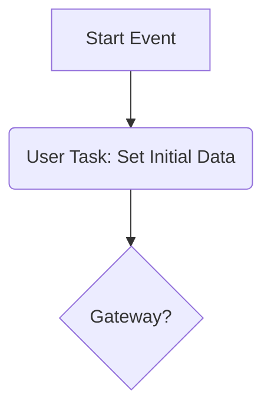

# Process Variable Behavior and the Initial User Task Pattern

This document clarifies how process variables are managed in the Abada Engine, particularly at the beginning of a process instance. Understanding this behavior is critical for designing robust and predictable workflows.

---

### The Initial State: Empty

When a new process instance is created via `abadaEngine.startProcess()`, its variables map is **completely empty**.

Inside the `ProcessInstance` constructor, the `variables` field is initialized as a `new HashMap<>()`. No variables are populated from the process definition or any other source at the moment of creation.

### The Lifecycle at Startup

The engine's startup behavior directly influences how you must handle initial variables:

1.  **Creation**: When you call `abadaEngine.startProcess("processId")`, the engine creates a new `ProcessInstance` object. At this moment, its execution token is placed at the process's `<startEvent>`.

2.  **Immediate Advancement**: The `AbadaEngine` does **not** wait for external input after creation. It immediately calls the `advance()` method on the new `ProcessInstance`.

3.  **Execution until Wait State**: The `advance()` method executes the process flow, following sequence flows and evaluating gateways until it either reaches a **wait state** (currently, a User Task) or an `endEvent`.

### How Variables Are Introduced

Given this "immediate advancement" behavior, you cannot pass variables directly to the `startProcess` method. The primary mechanism for introducing variables into a running process is when a task is completed.

The `abadaEngine.completeTask()` method accepts a `Map<String, Object> variables`. The engine merges these variables into the process instance *before* it calls `advance()` to move the process forward from the completed task. This ensures that any subsequent gateways can see and use the new data.

### The Initial User Task Pattern

This lifecycle leads to a crucial design pattern for any process that requires input data at the start.

If the first element after your `startEvent` is a gateway that depends on process variables, the workflow will likely fail or behave unexpectedly. The gateway will be evaluated during the initial `advance()` call, at which point the variable map is still empty.

**Solution: The Initial User Task Pattern**

To solve this, you should place a user task immediately after the start event. This creates a natural "pause" in the process.

This pattern ensures a reliable workflow:

1.  The engine starts the process.
2.  It immediately advances to the first user task (`Set Initial Data`) and then waits.
3.  This pause gives your application the opportunity to complete this initial task and, in doing so, provide the first set of process variables needed for the rest of the workflow.
4.  When the task is completed, the engine advances again, and the gateway is now evaluated with the correct data.

This is the recommended best practice for any process that does not begin with a simple, unconditional path.
