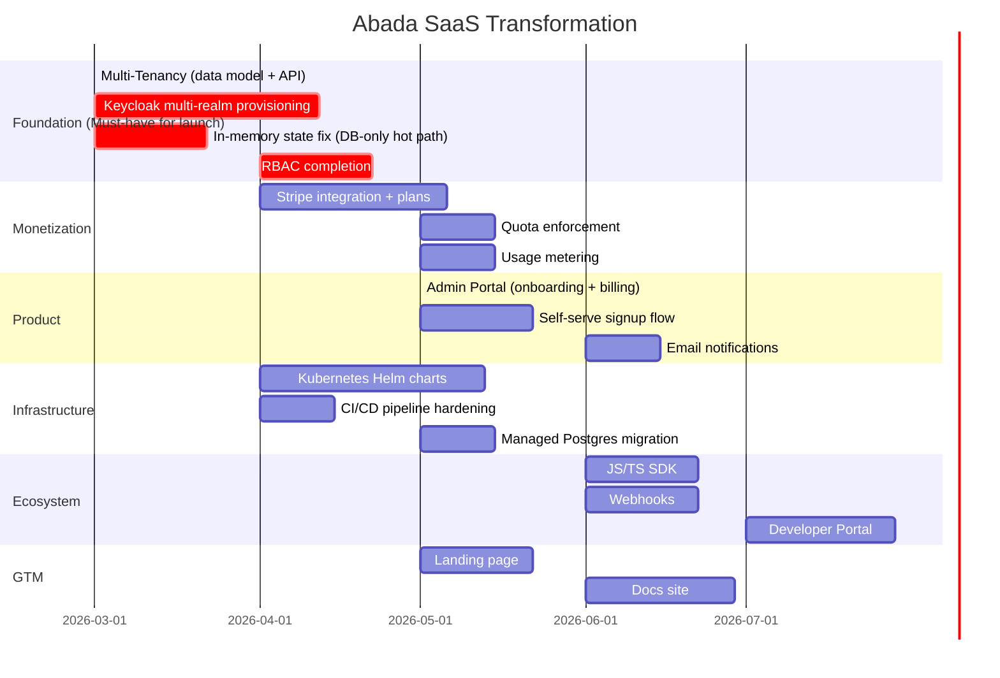

# Abada Platform → SaaS Transformation Roadmap

## Overview

The Abada Platform has an excellent technical foundation: a custom BPMN 2.0 engine, production-ready observability, a stateless horizontally-scalable architecture, and working UI components. What it currently lacks are the **SaaS-specific layers** that turn a self-hosted product into a multi-tenant, monetizable cloud service.

Below are the 7 pillars required, ordered by priority and dependency.

---

## Pillar 1 — Multi-Tenancy 🏢
**Priority: Critical (everything else depends on this)**

### Current State
The engine is single-tenant by design. There is no concept of an "organization" or "workspace": all process definitions, instances, tasks, and users share a single database schema and a single Keycloak realm.

### What's Needed

**1a. Data Isolation Strategy — choose one:**

| Model | Isolation Level | Complexity | Cost |
|-------|----------------|------------|------|
| **Schema-per-tenant** (PostgreSQL) | High | Medium | Medium |
| **Row-level security (RLS)** | Medium | Low | Low |
| **Database-per-tenant** | Very High | High | High |

> **Recommended**: Start with RLS (row-level isolation) using a `tenant_id` column on every entity. It's the fastest to implement and easy to migrate to schema-per-tenant later. Use PostgreSQL RLS policies so the engine can never accidentally leak cross-tenant data.

**1b. Engine-Level Changes**
- Add `tenantId` to all JPA entities: `ProcessDefinitionEntity`, `ProcessInstanceEntity`, `TaskEntity`, `ExternalTaskEntity`
- Pass `tenantId` through `AbadaEngine` operations and filter all queries by it
- `StateReloadService` must scope rehydration per-tenant

**1c. Identity & Auth — Keycloak Multi-Realm**
- Provision one Keycloak realm per tenant on signup → strong isolation for SSO/OIDC
- Or use a shared realm with tenant-specific groups + Keycloak Organizations feature (KC 24+)
- A **tenant provisioning service** must automate: realm creation, client registration, first admin user

**1d. Tenant Management API**
New internal/admin API:
```
POST   /api/admin/tenants          → provision new tenant
GET    /api/admin/tenants/{id}     → get tenant info
PATCH  /api/admin/tenants/{id}     → update limits/plan
DELETE /api/admin/tenants/{id}     → offboard
```

---

## Pillar 2 — Billing & Subscription Management 💳
**Priority: Critical**

### What's Needed

**2a. Stripe Integration (recommended)**
- Use **Stripe Billing** for subscriptions + **Stripe Checkout** for self-serve upgrades
- Webhook listener to sync subscription state into the tenant database
- Entitlement model: map plan → feature flags and resource limits

**2b. Plan & Quota Enforcement**
Define plan tiers (example):

| Plan | Process Instances/mo | Users | BPMN Uploads |
|------|---------------------|-------|-------------|
| Free | 500 | 3 | 5 |
| Starter | 10,000 | 10 | Unlimited |
| Pro | 100,000 | 50 | Unlimited |
| Enterprise | Unlimited | Unlimited | Unlimited + SLAs |

- Add quota checks in `AbadaEngine.startProcess()` and `deploy()` that fail gracefully with a `402 Payment Required`
- Quota counters tracked in Redis (or PostgreSQL with a monthly reset job)

**2c. Usage Metering**
- Leverage existing `EngineMetrics` — already emits `abada.process.instances.started` per process definition
- Add `tenant_id` label to all metrics
- Feed into Stripe Metered Billing for usage-based plans

---

## Pillar 3 — Self-Serve Onboarding & Admin Portal 🚀
**Priority: High**

### What's Needed

**3a. Public Signup Flow**
- Marketing landing page → Signup → Email verification → Tenant provisioning → Dashboard
- Integrate with Stripe Checkout for plan selection at signup

**3b. Admin Portal (new frontend)**
A dedicated admin experience (can extend Orun or be a new app):
- **Organization settings**: name, logo, SSO config
- **User management**: invite members, assign roles
- **Billing**: current plan, usage meter, invoices, upgrade/downgrade
- **API Keys**: generate/revoke API keys for external workers
- **Process definitions**: deploy/manage BPMN files (can reuse Orun's upload)
- **Audit log**: who did what and when

**3c. Email Notifications**
- Transactional emails: welcome, task assignment, process completion alerts
- SMS/push for mobile (future)
- Use **Resend** or **SendGrid** with templated emails

---

## Pillar 4 — Production Infrastructure (Cloud-Native) ☁️
**Priority: High**

### Current State
Docker Compose with 3 replicas and Traefik. Good for demo, not for SaaS scale.

### What's Needed

**4a. Kubernetes Migration**
- Write Helm charts for all services (engine, tenda, orun, keycloak, postgres, otel-stack)
- HPA (Horizontal Pod Autoscaler) for the engine — already partially documented in `architecture/overview.md`
- Use managed Postgres (AWS RDS / Neon / Supabase) instead of containerized

**4b. Managed Services**
| Component | Replace With |
|-----------|-------------|
| PostgreSQL container | AWS RDS / Neon / Supabase |
| Keycloak container | Self-hosted on K8s or Keycloak Cloud |
| OTEL Collector | AWS ADOT / GCP OTEL / self-hosted |
| Grafana | Grafana Cloud or self-hosted |

**4c. CI/CD Pipeline**
- GitHub Actions already exists (`.github/`) — expand it
- Pipeline: lint → test → build Docker image → push to registry → deploy to K8s (per environment)
- Semantic versioning + automated release notes
- Preview environments per PR

**4d. Disaster Recovery**
- Automated PostgreSQL backups (point-in-time recovery)
- Multi-AZ deployment
- RTO/RPO targets defined for each plan tier

**4e. State Management Fix** ⚠️
> The engine currently stores process instances in an in-memory `HashMap` inside `AbadaEngine.java`. This works for a single instance but is a **critical issue** for SaaS:
> - A pod restart loses all in-memory state (mitigated today by `StateReloadService` but it reloads all instances into memory — doesn't scale to thousands of tenants)
> - Fix: move to **fully database-driven state** on the hot path, use Redis for session/lock management

---

## Pillar 5 — Security Hardening 🔐
**Priority: High**

### What's Needed

**5a. RBAC Completion**
- Currently noted as "in progress" in README
- Implement role enforcement at the API layer for: `process:read`, `process:write`, `task:claim`, `task:complete`, `admin:*`
- Role assignments per-tenant, synced with Keycloak groups

**5b. API Key Authentication**
- External task workers need API keys (not user tokens)
- Implement: `POST /api/auth/keys` → creates an opaque API key stored as a hashed value
- Middleware to resolve API key → tenant + permissions

**5c. Audit Logging**
- Log every mutation (start process, complete task, deploy definition) with: who, what, when, from where
- Immutable audit log stored in a dedicated table or append-only log service

**5d. Data Encryption**
- Encrypt process variables at rest (variable JSON columns contain business data)
- TLS everywhere (already mostly done via Traefik)
- Secrets management via HashiCorp Vault or AWS Secrets Manager (replace `.env` files)

**5e. Compliance**
- GDPR: `DELETE /api/admin/tenants/{id}/data` must hard-delete all tenant data
- SOC 2 Type II readiness: access controls, audit logs, change management
- OWASP Top 10 review of REST API

---

## Pillar 6 — Developer Ecosystem & API 🛠️
**Priority: Medium**

### What's Needed

**6a. API Versioning & Stability**
- Stabilize all REST contracts (targeted in `0.9.0-alpha`)
- Strict API versioning (`/api/v1/`, `/api/v2/`)
- OpenAPI spec published and versioned (Swagger already exists)
- Deprecation policy documented

**6b. SDKs**
- **Java SDK** (already on roadmap for `1.0.0-beta`)
- **JavaScript/TypeScript SDK** (high demand — enables Node.js workers)
- **Python SDK** (data pipeline integration)
- Publish to Maven Central, npm, PyPI

**6c. Webhooks**
- SaaS customers expect push events, not polling
- Events: `process.started`, `process.completed`, `task.created`, `task.completed`, `task.assigned`
- Reliable delivery with retry + dead-letter queue

**6d. Developer Portal**
- Interactive API documentation (beyond Swagger)
- Quick-start guides and code samples
- Sandbox environment with pre-loaded demo processes

---

## Pillar 7 — Go-to-Market 📣
**Priority: Medium (can run in parallel)**

### What's Needed

**7a. Landing Page**
- Public marketing site targeting: "Lightweight Camunda/Flowable alternative", "BPMN automation for developers"
- Pricing page, feature comparison, documentation link, sign-up CTA

**7b. Positioning**
The platform's differentiators vs Camunda/Flowable/Temporal:
- ✅ Truly lightweight (no Camunda Platform baggage)
- ✅ Native OpenTelemetry observability out of the box
- ✅ Simple self-host OR SaaS
- ✅ Honest pricing (not "contact sales" for basic features)

**7c. Documentation Site**
- Move docs from Markdown files to a documentation platform (Docusaurus, Mintlify, or GitBook)
- Cover: Getting Started, BPMN Reference, API Reference, External Workers guide, SaaS Admin guide

**7d. Community**
- GitHub Discussions or Discord for early adopter community
- Public changelog / release notes page

---

## Implementation Sequence



---

## Quick Wins (Start This Week)

These don't require major architecture changes and unblock everything else:

1. **Add `tenant_id` column** to all JPA entities — schema-level change, establishes the tenancy contract
2. **API Key model** — simple table + hash-based lookup, unblocks external worker auth
3. **Fix `HashMap` in-memory state** — move to fully DB-driven, critical for multi-tenant correctness
4. **GitHub Actions CI** — ensure engine tests pass on every PR before any new feature work
5. **Stripe account setup** — register, define products/prices, get webhook endpoints ready
