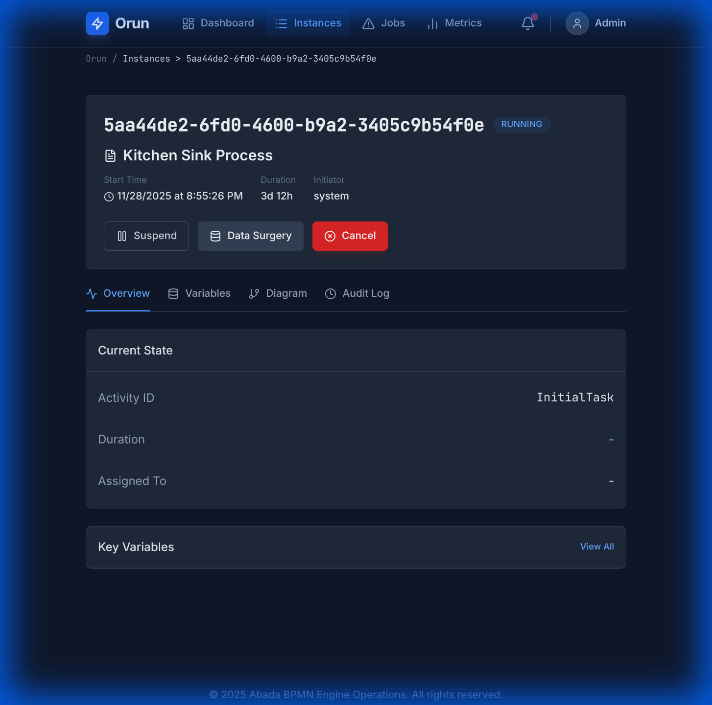
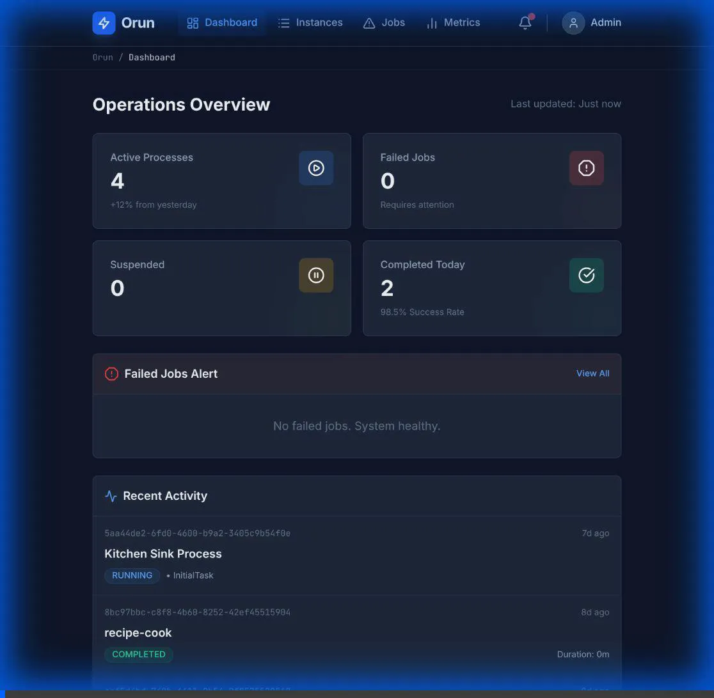
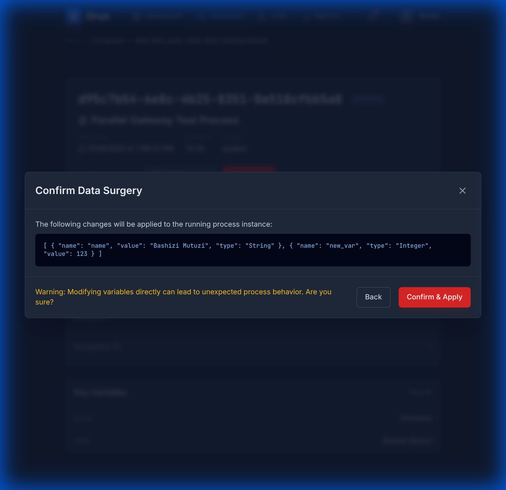
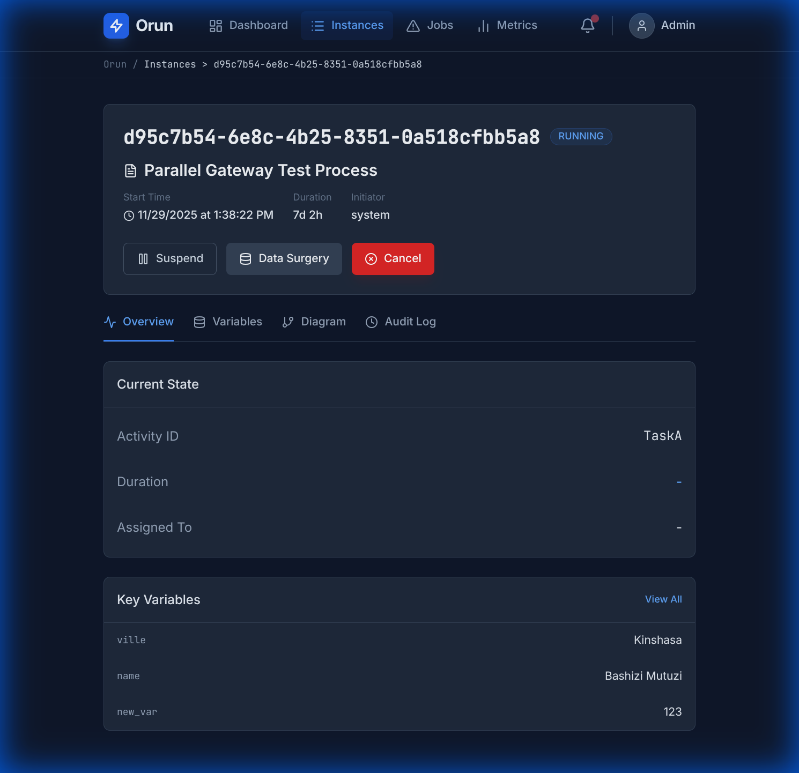

# Orun - Data Surgery User Guide

## Overview

The **Data Surgery** feature allows you to directly modify process variables in running process instances. This is a powerful troubleshooting tool for fixing stuck processes or correcting data issues without restarting the process.

## Accessing Data Surgery

1. Navigate to the **Instances** page
2. Click on a process instance to view its details
3. Click the **Data Surgery** button in the header

## Features

### 1. View Current Variables

When you open the Data Surgery modal, you'll see all current process variables displayed in a table with:

- **Variable Name**: The identifier for the variable
- **Type**: The data type (String, Integer, Long, Double, Float, Boolean, Json)
- **Value**: The current value

### 2. Edit Existing Variables

To modify an existing variable:

1. Locate the variable in the table
2. Click on the **Value** field
3. Enter the new value
4. The variable name and type are read-only for existing variables

**Note**: For Boolean variables, you'll see a dropdown with `true`/`false` options.

### 3. Add New Variables

To add a new variable to the process instance:

1. Click the **+ Add Variable** button at the bottom of the table
2. A new row will appear with a **blue highlight**
3. Fill in the required fields:
   - **Variable Name**: Enter a unique name (must start with letter/underscore, alphanumeric only)
   - **Type**: Select from the dropdown (String, Integer, Long, Double, Float, Boolean, Json)
   - **Value**: Enter the value

**Validation Rules**:

- Variable names cannot be empty
- Variable names must be unique (no duplicates)
- Variable names must start with a letter or underscore
- Variable names can only contain letters, numbers, and underscores

If validation fails, you'll see a red error message below the input field.

### 4. Delete Variables

To remove a variable:

1. Click the **trash icon** (🗑️) in the Actions column
2. The variable will be removed from the table immediately
3. The deletion will be applied when you confirm the changes

You can delete both existing variables and newly added variables (before saving).

## Saving Changes

### Step 1: Review Changes

1. After making your edits, click **Review Changes**
2. If there are validation errors, they will be displayed and you cannot proceed
3. If validation passes, you'll see a confirmation screen

### Step 2: Confirm

The confirmation screen shows:

- A warning message about the risks of data surgery
- A JSON preview of all variables (including your changes)

### Step 3: Apply

1. Review the changes carefully
2. Click **Confirm & Apply** to save
3. Or click **Back** to return to editing

### Step 4: Verification

After saving:

- The modal will close automatically
- The page will refresh to show updated data
- Check the **Variables** tab to verify your changes

## Use Cases

### Fixing Stuck Processes

**Scenario**: A process is waiting for a variable that was never set.

**Solution**:

1. Open Data Surgery
2. Click "+ Add Variable"
3. Enter the missing variable name and value
4. Save changes
5. The process should now continue

### Correcting Data Errors

**Scenario**: A variable has an incorrect value causing the process to fail.

**Solution**:

1. Open Data Surgery
2. Find the variable in the table
3. Edit the value to the correct one
4. Save changes

### Removing Invalid Variables

**Scenario**: A variable was added by mistake and is causing issues.

**Solution**:

1. Open Data Surgery
2. Click the trash icon next to the variable
3. Save changes

## Visual Guide

### Variable Types

| Type | Example Value | Input Type |
|------|---------------|------------|
| String | `"Hello World"` | Text input |
| Integer | `42` | Number input |
| Long | `9223372036854775807` | Number input |
| Double | `3.14159` | Decimal input |
| Float | `2.718` | Decimal input |
| Boolean | `true` or `false` | Dropdown |
| Json | `{"key": "value"}` | Text input |

### Visual Indicators

- **Gray background**: Existing variables (name and type are read-only)
- **Blue background with blue left border**: New variables (all fields editable)
- **Red text**: Validation errors
- **Red trash icon**: Delete button (hover to see tooltip)

## Tips & Best Practices

### ✅ Do's

- **Verify the process state** before making changes
- **Use meaningful variable names** that follow naming conventions
- **Test changes** in a development environment first if possible
- **Document your changes** for audit purposes
- **Check the Variables tab** after saving to confirm changes

### ❌ Don'ts

- **Don't modify variables** without understanding their purpose
- **Don't use special characters** in variable names (only letters, numbers, underscores)
- **Don't create duplicate variables** (validation will prevent this)
- **Don't skip the confirmation screen** - always review your changes

## Troubleshooting

### Changes Not Saving

**Problem**: Clicked "Confirm & Apply" but variables didn't update.

**Solutions**:

- Check browser console for error messages (F12 → Console tab)
- Verify the backend API is running
- Ensure you have proper permissions
- Try refreshing the page and attempting again

### Validation Errors

**Problem**: Can't proceed past the edit screen.

**Solutions**:

- Check for red error messages below input fields
- Ensure variable names are unique
- Verify variable names follow the naming rules
- Make sure no required fields are empty

### Variable Not Appearing

**Problem**: Added a variable but it doesn't show in the Variables tab.

**Solutions**:

- Wait a few seconds and refresh the page
- Check if the variable was actually saved (look for console logs)
- Verify the API call succeeded (Network tab in browser DevTools)

## Keyboard Shortcuts

- **Tab**: Move to next field
- **Shift + Tab**: Move to previous field
- **Enter**: In text inputs, moves to next field
- **Esc**: Close modal (if no unsaved changes)

## Security & Permissions

The Data Surgery feature requires:

- Access to the process instance
- Proper user authentication (X-User header)
- Appropriate group membership (X-Groups header)

**Warning**: Data Surgery directly modifies process state. Use with caution in production environments.

## Related Documentation

- [API Documentation](../api-docs.md) - Variable Management endpoints
- [Data Surgery Fix Documentation](../data-surgery-fix.md) - Technical implementation details
- [Container Refresh Guide](../container-refresh.md) - Docker deployment

## Support

For issues or questions:

1. Check the browser console for error messages
2. Review the API documentation
3. Contact your system administrator
4. Check backend logs for API errors

---

**Last Updated**: December 6, 2025  
**Version**: 1.0
