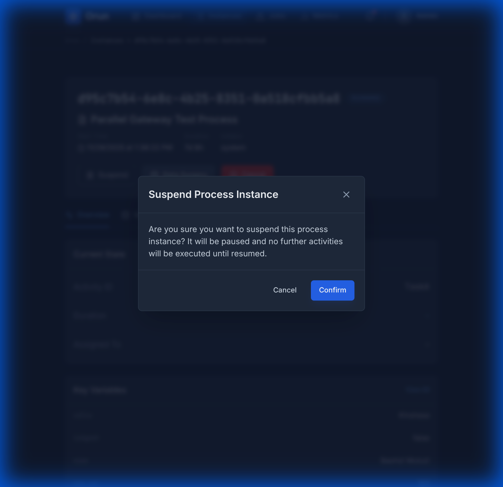
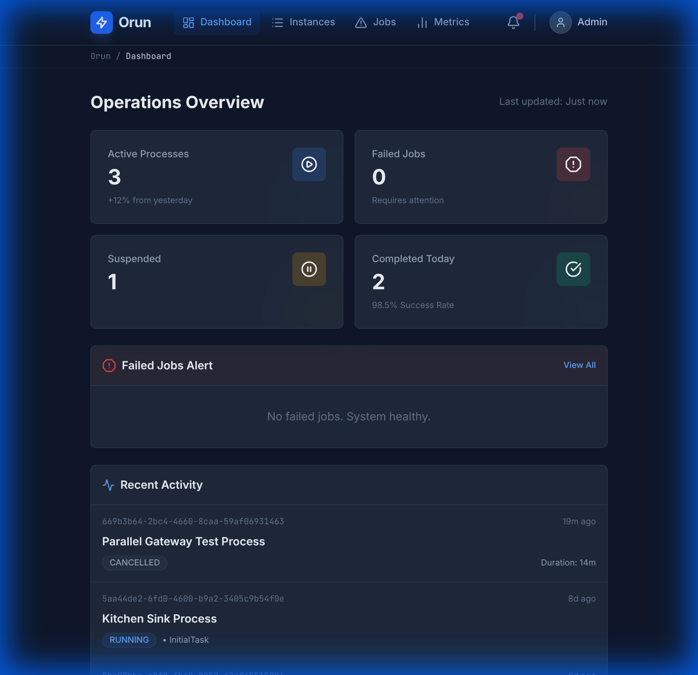
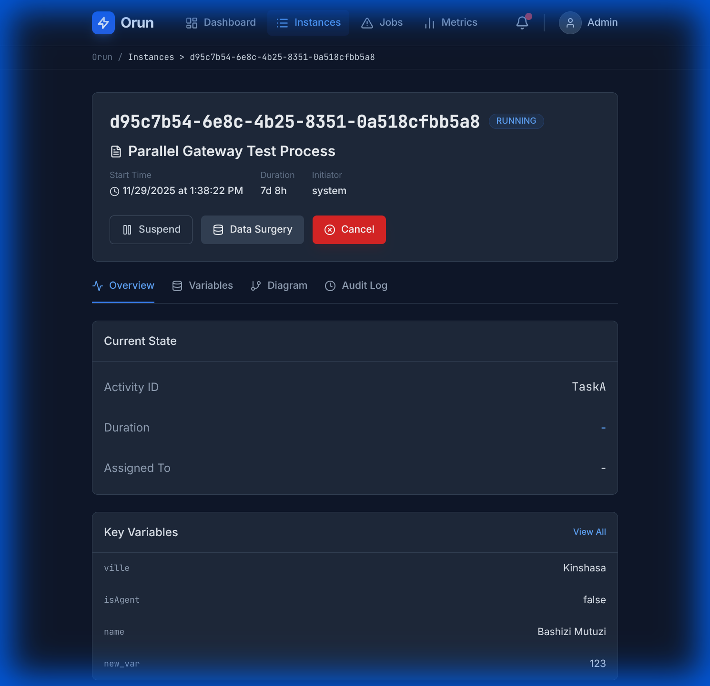
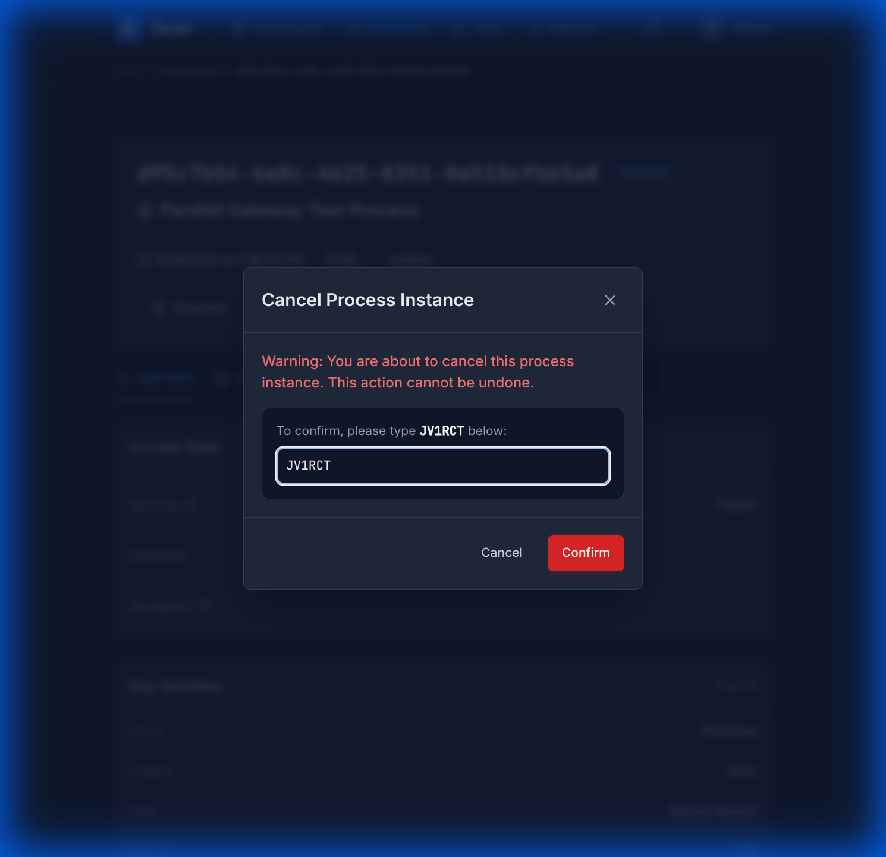
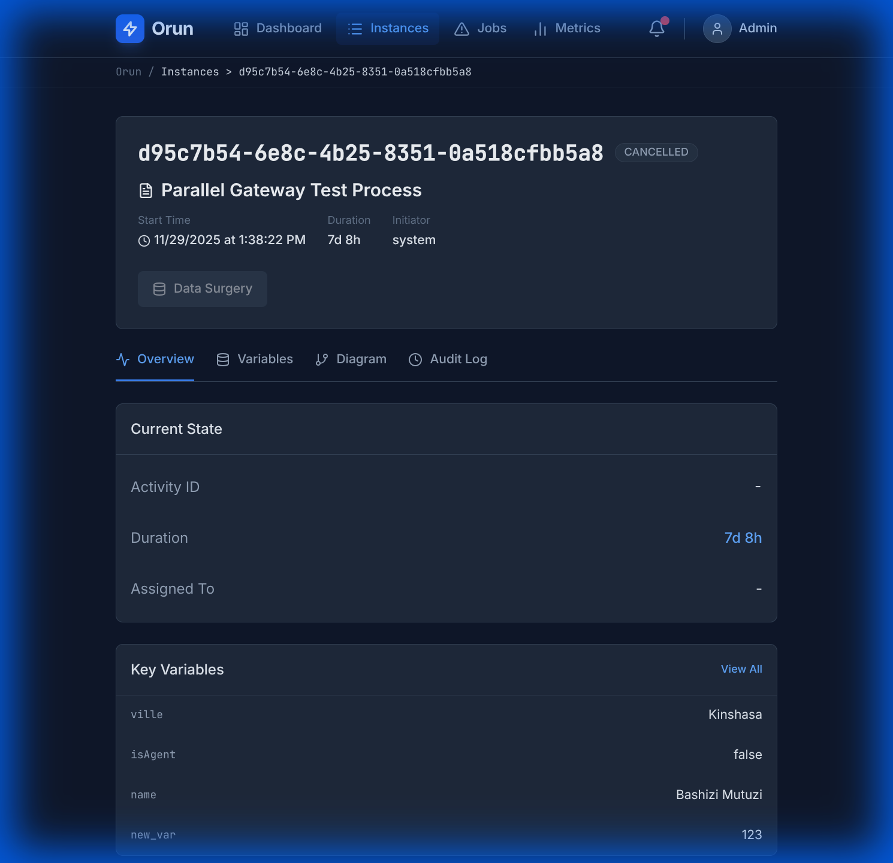

# Process Instance Management Guide

This guide covers the operations available for managing the lifecycle of process instances in Orun.

## Table of Contents

- [Overview](#overview)
- [Suspending Instances](#suspending-instances)
- [Resuming Instances](#resuming-instances)
- [Cancelling Instances](#cancelling-instances)
- [Handling Failed Jobs](#handling-failed-jobs)
- [Safety Features](#safety-features)

## Overview

Orun provides powerful controls to manage running process instances. You can pause execution to investigate issues, resume when ready, or permanently cancel instances that are no longer needed. All these actions are protected by confirmation dialogs to prevent accidental changes.

## Suspending Instances

If you need to temporarily pause a process instance (e.g., to fix data issues or wait for an external system), you can use the **Suspend** feature.

1. Navigate to the instance detail page or find the instance in the list.
2. Click the **Suspend** button (Pause icon).
3. A confirmation dialog will appear.

4. Click **Confirm** to suspend the instance.
5. The status will change to `SUSPENDED` (amber badge).

**Note:** While suspended, no activities will be executed for this instance.

## Resuming Instances

To continue execution of a suspended instance:

1. Navigate to the suspended instance.
2. Click the **Resume** button (Play icon).
3. Confirm the action in the dialog.
4. The status will return to `RUNNING` (blue badge), and execution will proceed from where it left off.

## Cancelling Instances

If a process instance is no longer needed or was started in error, you can permanently cancel it.

**Warning:** This action is irreversible.

1. Click the **Cancel** button (X icon).
2. A security confirmation dialog will appear, requiring you to type a random verification code.

3. Type the code exactly as shown. The **Confirm** button will remain disabled until the correct code is entered.

4. Click **Confirm** to cancel the instance.
5. The status will change to `CANCELLED` (gray badge).

## Handling Failed Jobs

When a process instance encounters an error (e.g., a service task fails), it enters a `FAILED` state (often indicated by a red badge). Orun allows you to inspect and resolve these failures.

### Viewing Failure Details

1. Navigate to the failed process instance.
2. Locate the **Incidents** or **Failed Jobs** panel.
3. You will see a list of failed jobs with their error messages.
4. Click on the error message to view the full **Stacktrace**. This helps in diagnosing the root cause (e.g., network timeout, invalid data).

### Retrying Jobs

Once you have identified and resolved the issue (e.g., by fixing an external system or updating process variables via Data Surgery), you can retry the job.

1. In the Failed Jobs panel, click the **Retry** button (circular arrow icon) next to the failed job.
2. The system will increment the retry count for the job.
3. The engine will attempt to execute the job again.
    - If successful, the instance status will return to `RUNNING`.
    - If it fails again, the retry count will decrease, and it will eventually return to the failed state.

## Safety Features

To ensure operational safety:

- **Confirmation Dialogs**: All status changes require explicit confirmation.
- **Verification Code**: Cancellation requires typing a random 6-character code to prevent accidental clicks.
- **Data Surgery Protection**: The "Data Surgery" feature is automatically **disabled** for cancelled instances to prevent modifying data of terminated processes.
